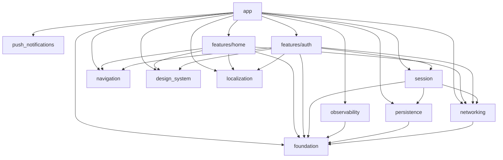

# 架構總覽

本文件描述 workspace 拓撲、依賴方向的四條規則與其機器可驗證的白名單、以及三條貫穿全專案的關鍵鏈路。權威來源為
[`docs/superpowers/specs/2026-07-11-flutter-app-template-design.md`](superpowers/specs/2026-07-11-flutter-app-template-design.md)
(以下簡稱「規格」),本文件所有程式碼片段皆節錄自現存檔案並標註路徑。

## 1. Workspace 拓撲(現況 12 成員)

根 [`pubspec.yaml`](../pubspec.yaml) 的 `workspace:` 清單即為單一真相:

```yaml
workspace:
  - app
  - features/auth
  - features/home
  - packages/design_system
  - packages/foundation
  - packages/localization
  - packages/navigation
  - packages/networking
  - packages/observability
  - packages/persistence
  - packages/push_notifications
  - packages/session
```

12 個成員 = 1 個 `app` + 9 個 `packages/*` + 2 個 `features/*`。每個成員一句話職責(取自各自 `pubspec.yaml` 的 `description`):

| 成員 | 職責(一句話) |
|---|---|
| `app` | 組裝層:flavor 進入點、DI、路由、shell。([`app/pubspec.yaml`](../app/pubspec.yaml)) |
| `packages/foundation` | 純 Dart 基礎型別:`Result`、`AppException`、logger 介面。零依賴。([`packages/foundation/pubspec.yaml`](../packages/foundation/pubspec.yaml)) |
| `packages/networking` | dio 封裝:client 工廠、攔截器、統一錯誤轉換;定義 `TokenProvider` 契約。([`packages/networking/pubspec.yaml`](../packages/networking/pubspec.yaml)) |
| `packages/persistence` | 本地儲存:key-value 與 secure storage 的介面與實作。([`packages/persistence/pubspec.yaml`](../packages/persistence/pubspec.yaml)) |
| `packages/session` | 登入狀態單一真相:token 儲存、`SessionState` stream、`TokenProvider` 實作。([`packages/session/pubspec.yaml`](../packages/session/pubspec.yaml)) |
| `packages/navigation` | 跨 feature 導航契約:路由路徑常數與型別化路由。([`packages/navigation/pubspec.yaml`](../packages/navigation/pubspec.yaml)) |
| `packages/design_system` | design tokens、theme、共用 UI 元件與頁面外框元件。([`packages/design_system/pubspec.yaml`](../packages/design_system/pubspec.yaml)) |
| `packages/localization` | 多語系(官方 gen-l10n + ARB),含各 feature 文案。([`packages/localization/pubspec.yaml`](../packages/localization/pubspec.yaml)) |
| `packages/observability` | log 輸出端、crash 上報、事件埋點(介面 + Firebase 實作)。([`packages/observability/pubspec.yaml`](../packages/observability/pubspec.yaml)) |
| `packages/push_notifications` | 推播抽象介面 + FCM 實作、token 生命週期、點擊轉路由事件。([`packages/push_notifications/pubspec.yaml`](../packages/push_notifications/pubspec.yaml)) |
| `features/auth` | 登入功能:domain/data 層、`AuthTokenRefreshGateway`、路由與 DI 註冊。([`features/auth/pubspec.yaml`](../features/auth/pubspec.yaml)) |
| `features/home` | 首頁功能:domain/data/presentation 層(項目清單與詳情頁、blocs)。([`features/home/pubspec.yaml`](../features/home/pubspec.yaml)) |

`packages/native/<capability>` 為規格 §2.1 定義的原生能力群插槽,本模板尚未附示範能力,故不計入現況 12 成員。

## 2. 依賴方向規則(四條,規格 §2.2)

1. `foundation` 不依賴任何東西(純 Dart,不依賴 Flutter)。
2. `packages/*` 之間允許依賴,但必須單向、且在本文件的依賴圖中明列;永遠不能依賴 `features/*` 或 `app`。
3. `features/*` 可依賴 `packages/*` 與 `foundation`;**永遠不能依賴其他 feature**,不能依賴 `app`。
4. `app` 是唯一什麼都能依賴的地方,負責組裝(DI、路由表、flavor 進入點),自身幾乎不含邏輯。

機制(規格首段的精準描述):pub workspace 是共享 resolution,未宣告依賴的 import 仍編譯得過;真正守住邊界的是 `analysis_options.yaml` 把 `depend_on_referenced_packages` 升為 **error** 級 + CI 的 `flutter analyze` 硬性把關,加上 `tool/check.sh` 的「pubspec 依賴稽核」步驟(見下)。也就是說邊界是「pubspec 宣告式 + lint error + CI 強制」,機器可驗證、不靠人力紀律,但不是編譯器級。

`depend_on_referenced_packages` 只能擋「未宣告卻 import」;擋不住「宣告了被禁止的依賴」(如某 package 在 `pubspec.yaml` 直接寫 `home: any`)。這一半由 [`tool/check.sh`](../tool/check.sh) 第 3 步的腳本稽核補上:掃描 `features/*` 的 `dependencies:` 區段不得含其他 `features/*`,`packages/*` 的 `dependencies:` 區段不得含任何 `features/*` 或 `app`。四條規則因此全數機器可驗證。

### 2.1 依賴白名單(從各 `pubspec.yaml` 現況彙整)

僅列 workspace 內部依賴(第三方套件如 `dio`、`flutter_bloc` 省略)。

| 成員 | 依賴的 workspace 成員 |
|---|---|
| `packages/foundation` | (無) |
| `packages/navigation` | (無) |
| `packages/networking` | `foundation` |
| `packages/persistence` | `foundation` |
| `packages/session` | `foundation`、`networking`、`persistence` |
| `packages/design_system` | (無) |
| `packages/localization` | (無) |
| `packages/observability` | `foundation` |
| `packages/push_notifications` | (無) |
| `features/auth` | `design_system`、`foundation`、`localization`、`navigation`、`networking`、`session` |
| `features/home` | `design_system`、`foundation`、`localization`、`navigation`、`networking` |
| `app` | `auth`、`design_system`、`foundation`、`home`、`localization`、`navigation`、`networking`、`observability`、`persistence`、`push_notifications`、`session` |

### 2.2 依賴圖(mermaid)



## 3. 三條關鍵鏈路

### 3.1 401 refresh 鏈

單一飛行(single-flight)且不遞迴的 token 換發,橫跨三個 package:

1. **`AuthInterceptor`**([`packages/networking/lib/src/auth_interceptor.dart`](../packages/networking/lib/src/auth_interceptor.dart))——`QueuedInterceptor`,`onRequest` 注入 `Authorization` header;`onError` 在收到 401 且該請求尚未重試過時,呼叫 `TokenProvider.refreshTokens()`,成功後用 `_retryClient`(不含本攔截器的獨立 `Dio`)重送一次。若失敗請求所帶的 token 已與現行 token 不同(代表併發的另一請求期間已完成 refresh),直接沿用現行 token 重試,不再重覆呼叫 `refreshTokens()`。
2. **`TokenProvider`**([`packages/networking/lib/src/token_provider.dart`](../packages/networking/lib/src/token_provider.dart))——`networking` 只定義的介面(`currentAccessToken()` / `refreshTokens()`),不實作,避免 `networking → session` 的循環依賴。
3. **`SessionManager`**([`packages/session/lib/src/session_manager.dart`](../packages/session/lib/src/session_manager.dart))——實作 `TokenProvider`。`refreshTokens()` 以 `_inflightRefresh` 欄位做單一飛行:同時多個請求觸發 401 時只會有一次真正的 `_doRefresh()`,其餘呼叫共用同一個 `Future`。
4. **`AuthTokenRefreshGateway`**([`features/auth/lib/src/data/auth_token_refresh_gateway.dart`](../features/auth/lib/src/data/auth_token_refresh_gateway.dart))——`SessionManager._doRefresh()` 呼叫的實際換發實作,建構參數 `ApiClient` 必須以 `createPlainDio`(不含 `AuthInterceptor`)組裝,否則 refresh 請求本身收到 401 會遞迴觸發 refresh。這個「plain client」工廠見 [`packages/networking/lib/src/create_dio.dart`](../packages/networking/lib/src/create_dio.dart) 的 `createPlainDio`,並在 [`app/lib/src/di/compose_dependencies.dart`](../app/lib/src/di/compose_dependencies.dart) 組裝時傳入 `TokenRefreshGateway` 的註冊式。

依賴方向:`session → networking → foundation`(規格 §2.3)。

已知邊角:沒有帶 `Authorization` header 的請求(尚未登入前發出的公開 API)若收到 401,`AuthInterceptor` 會直接以現行 token 重試一次,不觸發 `refreshTokens()`——因為判斷「是否已重試過」看的是 token 是否變動,無 header 時沒有 token 可比對,退回同一路徑。此為有意識接受的邊角,不視為 bug(規格 §10 第 15 條)。

### 3.2 bootstrap 五步

唯一實作於 [`app/lib/src/bootstrap.dart`](../app/lib/src/bootstrap.dart) 的 `bootstrap()`:

```dart
Future<void> bootstrap(AppConfig config) async {
  WidgetsFlutterBinding.ensureInitialized(); // 1
  final gi = GetIt.instance;
  await composeDependencies(gi, config); // 2 純註冊
  installErrorHooks( // 3
    logger: ConsoleLogger(),
    reporter: gi<CrashReporter>(),
  );
  await gi.allReady(); // 4a persistence 等就緒
  if (config.firebaseEnabled) { // 4b
    await Firebase.initializeApp();
    await gi<BufferingCrashReporter>().attach(
      CrashlyticsCrashReporter(FirebaseCrashlytics.instance),
    );
  }
  await gi<SessionManager>().restore(); // 4c
  runApp(App(gi: gi)); // 5
}
```

1. `WidgetsFlutterBinding.ensureInitialized()`。
2. `composeDependencies(gi, config)`——純註冊,不做 I/O。
3. 掛載全域錯誤捕捉:`FlutterError.onError` + `PlatformDispatcher.instance.onError` → `observability`(`installErrorHooks`,同檔)。
4. `await` 必要初始化:`gi.allReady()`(persistence 等就緒)→(若 `firebaseEnabled`)`Firebase.initializeApp()` 並把 `BufferingCrashReporter` 接上真正的 `CrashlyticsCrashReporter` → `SessionManager.restore()`。
5. `runApp(App(gi: gi))`。

第 3 步先於第 4b 步(Firebase init)掛上錯誤捕捉,期間發生的例外由 `BufferingCrashReporter` 緩衝、`attach()` 時排水補送(詳見 [ADR-0005](adr/0005-buffering-crash-reporter.md))。

### 3.3 三個全域行為的唯一處

| 行為 | 唯一處(檔案) | 說明 |
|---|---|---|
| 登入守衛 | [`app/lib/src/router/app_router.dart`](../app/lib/src/router/app_router.dart) 的 `buildRouter()` `redirect` | 讀 `session.state`:未登入且目標非 login → 導向 login;已登入且目標為 login → 導向 home。`refreshListenable`(見 [`app/lib/src/router/session_refresh_listenable.dart`](../app/lib/src/router/session_refresh_listenable.dart))訂閱 `SessionManager.states`,每次事件觸發 go_router 重新評估 `redirect`。 |
| token 失效登出 | [`packages/session/lib/src/session_manager.dart`](../packages/session/lib/src/session_manager.dart) 的 `_doRefresh()` 呼叫 `signOut()`(清除本地 tokens、發布 `SessionUnauthenticated`)+ 上列 `app_router.dart` 的 `redirect` 對該狀態反應 | refresh 回傳 `UnauthorizedException` 時才真正登出(`_doRefresh` 內以 `exception is UnauthorizedException` 判斷);其餘暫時性失敗(斷網、5xx)保留 tokens,不登出。清資料的唯一處是 `SessionManager`,「導回登入」的唯一處是 router 的 `redirect`——兩者透過 `states` stream 串接,app 層不再另外訂閱。 |
| 推播點擊轉路由 | [`app/lib/src/app.dart`](../app/lib/src/app.dart) 的 `_AppState.initState()` | 訂閱 `PushNotifications.taps`,`routePath` 非 null 時 `_router.go(routePath)`;另於首幀後呼叫 `PushNotifications.initialTap()` 處理冷啟動點擊。兩者最終都經過上列 router 的登入守衛評估。 |

### 3.4 啟動 gate(強制更新/維護模式)歸屬(規範性指引,規格 §10.27)

模板不預建強制更新或維護模式功能,但若專案要加,歸屬定為:

- **檢查位置**:`bootstrap.dart` 第 4 步(`await` 必要初始化,見 §3.2)之後、
  `runApp()` 之前——與 Firebase init、`SessionManager.restore()` 同一批
  「啟動期一次性遠端檢查」,結果(如最低版本號、維護旗標)存進一個
  supporting 狀態(例如另一個 app 生命週期單例或 `SessionManager` 旁的
  獨立 manager),供 router 讀取。
- **攔截位置**:`app_router.dart` 的 `redirect`,置於登入守衛**之前**評估
  (最高優先層)——強制更新/維護頁面必須攔在登入判斷之前,未登入使用者
  也要被擋。與登入守衛共用同一個 `redirect` 函式、依序判斷,不建第二個
  redirect 機制。
- **為何模板不預建實作**:是否需要強制更新/維護模式、判斷依據(版本比對
  API、feature flag 服務、遠端 config)因專案而異,模板無法代為決定介面
  形狀;比照 [`add-a-native-capability.md`](how-to/add-a-native-capability.md)
  的先例——只給規範性指引與唯一處歸屬,不出廠一組用不到的抽象。

## 4. 相關文件

- 命名、Bloc 規範、測試規範等寫作慣例:[`conventions.md`](conventions.md)
- 架構決策紀錄:[`adr/`](adr/)
